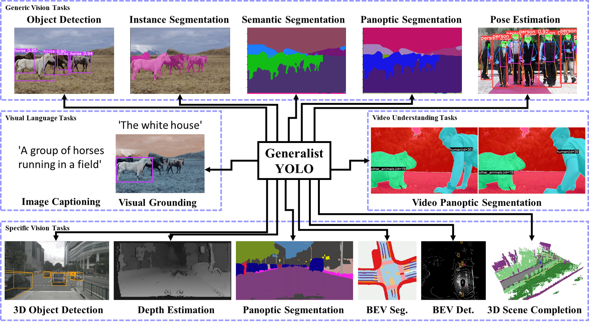

# GeneralistYOLO
Generalist YOLO: Towards Real-Time End-to-End Multi-Task Visual Language Models

<div align="center">
    <a href="./">
        
    </a>
</div>


## Performance 

...

## Installation 

...

## Evaluation

...

## Training  

...

## Citation

```
@inproceedings{wang2024yolov9,
  title={{Generalist YOLO}: Towards Real-Time End-to-End Multi-Task Visual Language Models},
  author={Chang, Hung-Shuo and Wang, Chien-Yao and Wang, Richard and Chou, Gene and Liao, Hong-Yuan Mark},
  booktitle={IEEE/CVF Winter Conference on Applications of Computer Vision (WACV)},
  year={2025}
}
```

## Contributors

<details><summary> <b>Contributors</b> </summary>
    
* @ws6125 : Most of generic vision tasks and visual language tasks.
* @110598074 : Most of specific vision tasks.
* @F84064014 : Video panoptic segmentation.
* @k22708038 : Visual grounding.
* @HuChengXue : Whole body pose estimation.
* ...

</details>


## Acknowledgements

<details><summary> <b>Reference Codes</b> </summary>

* [https://github.com/WongKinYiu/yolov9](https://github.com/WongKinYiu/yolov9)
* [https://github.com/davidnvq/grit](https://github.com/davidnvq/grit)
* [https://github.com/djiajunustc/TransVG](https://github.com/djiajunustc/TransVG)
* [https://github.com/Robertwyq/PanoOcc](https://github.com/Robertwyq/PanoOcc)
* [https://github.com/junjiehe96/FastInst](https://github.com/junjiehe96/FastInst)
* [https://github.com/fan23j/yolov7-pose-whole-body](https://github.com/fan23j/yolov7-pose-whole-body)
* ...

</details>
